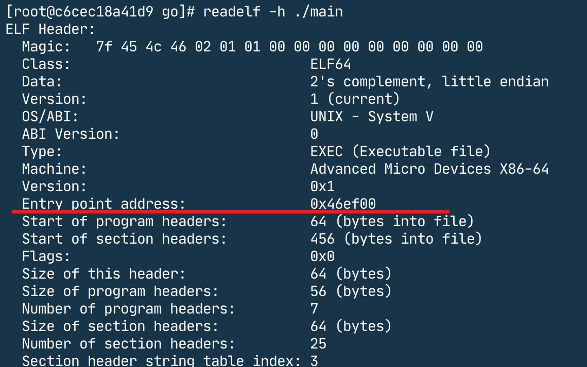
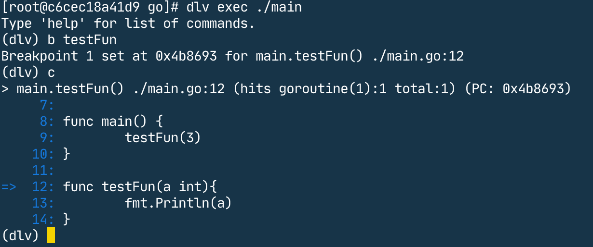
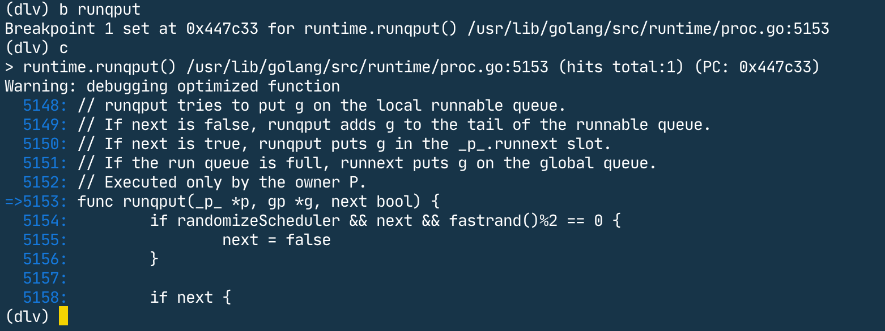
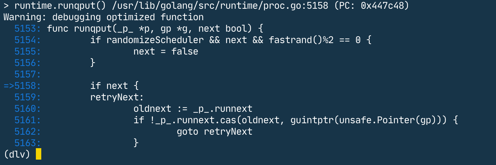
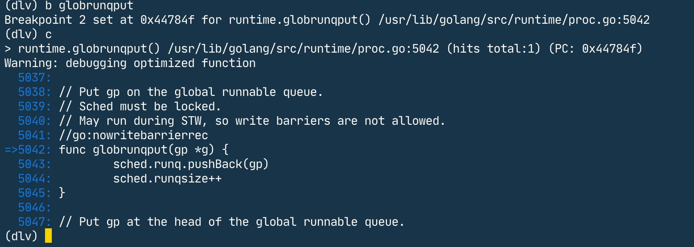
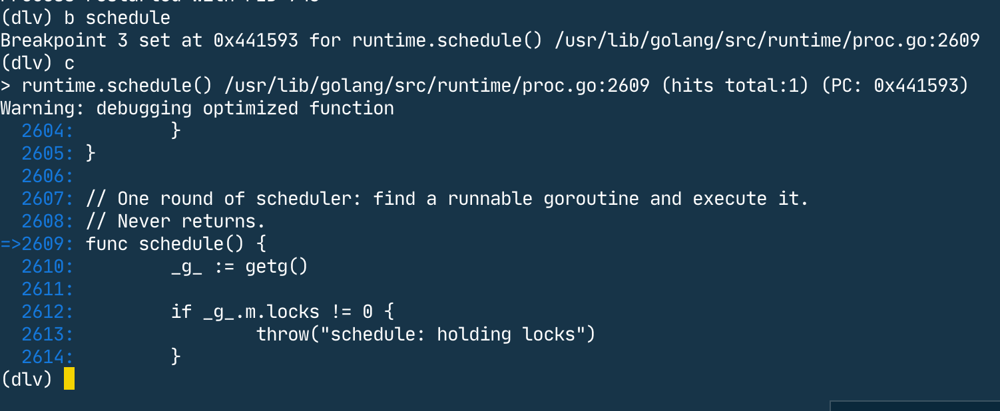
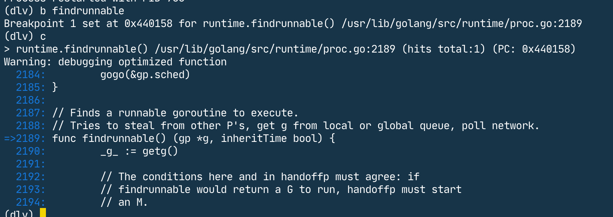
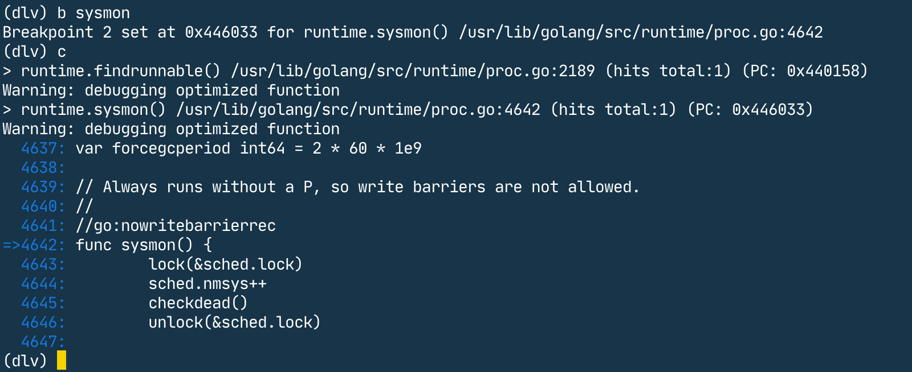

## 部署docker环境

Dockerfile 文件内容

```dockerfile
FROM centos
RUN yum install golang -y \
&& yum install dlv -y \
&& yum install binutils -y \
&& yum install vim -y \
&& yum install gdb -y
```

### Dockerfile 使用

```docker build -t test```

### 启动docker

```docker run -it --rm test bash```

### 测试程序

```go
package main

import (
    "fmt"
)


func main() {
	fmt.Println("hello world")
}
```

编译go文件
**go build -gcflags "all=-l -N" main.go**


## 查看编译后的进程入口地址

**readelf -h ./main**



## 在 dlv 调试工具中，使用断点功能找到代码位置

```shell
dlv exec ./main
```



找到了自定义的**testFun**方法

b 函数名字： 该命令是打断点

c : 继续执行

### 找到runtime下的方法

go 的版本是1.15

runqput，runqget，globrunqput，globrunqget

#### runqput

从断点信息可以知道，该函数在**/usr/lib/golang/src/runtime/proc.go**文件的5153行。



#### runqget



#### globrunqput



#### globrunqget


#### schedule



#### findrunnable



#### sysmon



